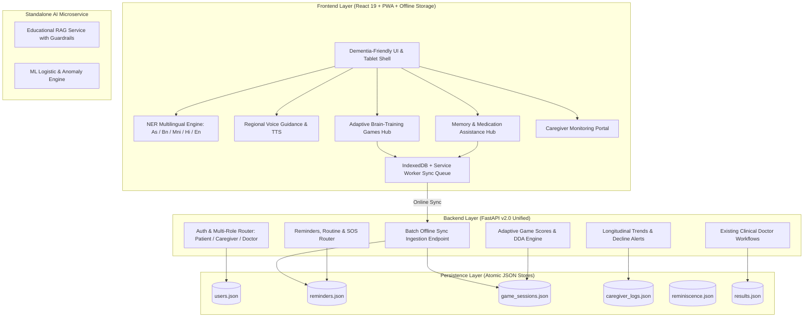

# SIH PS 26003 — Comprehensive Implementation Plan

> **Target:** Transform NeuroAid into a full-featured, culturally-localized, offline-first Cognitive Gaming and Memory Assistance Platform for Elderly Dementia Patients in the North Eastern Region (NER).  
> **Constraint:** Do not write implementation code yet. Do not delete or break existing functionality. Preserve all existing clinical screening, doctor workflows, and scoring logic.

---

## Architecture Overview Post-Implementation



---

## Phase 1: Core Caregiver Role, Multi-Role Auth & Relationship Mapping

### 1.1 Overview
Extend the user authentication and identity system to support a first-class `caregiver` role. Caregivers can register, link to one or more elderly dementia patients via a unique 6-character Caregiver Pairing Code or patient email, and manage patient profiles.

### 1.2 Files to Create
- `backend/routers/caregiver_api.py`: Caregiver-specific endpoints for patient association, profile management, and dashboard data aggregation.
- `frontend/src/pages/CaregiverDashboard.jsx`: Caregiver portal displaying linked patient status, medication compliance, game completion, and decline alerts.
- `frontend/src/pages/CaregiverPatientLink.jsx`: Caregiver interface for generating and linking patient connection codes.

### 1.3 Files to Modify
- `backend/models/schemas.py`: Add `caregiver` role to `RegisterRequest` and `LoginRequest`; add `CaregiverLinkRequest`, `CaregiverPatientSummary`, and `CaregiverProfile` models.
- `backend/services/auth_service.py`:
  - Update `register_user()` to validate `role in {"patient", "doctor", "caregiver"}`.
  - Implement `link_caregiver_to_patient(caregiver_id, patient_id_or_code)`.
  - Implement `get_patients_for_caregiver(caregiver_id)`.
  - Implement `require_caregiver(authorization)`.
- `backend/routers/auth_api.py`: Add `/auth/caregiver/link` and `/auth/caregiver/patients` endpoints.
- `backend/main.py`: Mount `caregiver_api.router`.
- `frontend/src/pages/Login.jsx`: Add a three-way role switcher tab: **Patient** / **Family Caregiver** / **Doctor**.
- `frontend/src/App.jsx`: Integrate the `caregiver` role into top-level navigation and state routing.
- `frontend/src/services/api.js`: Add API helper methods for caregiver linking and data retrieval; export missing `submitChat`.

### 1.4 APIs Required

#### `POST /api/auth/register` (Modified)
- **Request Body:**
  ```json
  {
    "full_name": "Bikash Borah",
    "email": "bikash@example.com",
    "password": "SecurePassword123",
    "role": "caregiver",
    "phone": "+919876543210",
    "caregiver_relationship": "Son",
    "patient_code": "NER492"
  }
  ```
- **Response:** `AuthResponse` (`{ message: "Registration successful", token: "...", user: {...} }`).

#### `POST /api/caregiver/link-patient` (New)
- **Header:** `Authorization: Bearer <token>`
- **Request Body:** `{ "patient_code": "NER492" }` or `{ "patient_email": "patient@example.com" }`
- **Response:**
  ```json
  {
    "success": true,
    "message": "Patient linked successfully",
    "patient": {
      "id": "uuid-pat-1",
      "full_name": "Bhaben Borah",
      "age": 74,
      "language_preference": "as"
    }
  }
  ```

#### `GET /api/caregiver/patients` (New)
- **Header:** `Authorization: Bearer <token>`
- **Response:**
  ```json
  {
    "patients": [
      {
        "id": "uuid-pat-1",
        "full_name": "Bhaben Borah",
        "age": 74,
        "dementia_stage": "Mild",
        "pairing_code": "NER492",
        "last_active": "2026-09-09T08:30:00Z",
        "today_adherence": { "meds_taken": 2, "meds_total": 3, "games_played": 2 },
        "recent_alert": "none"
      }
    ]
  }
  ```

### 1.5 Database / Persistence Changes
- **Store:** `backend/data/users.json`
- **Schema Updates:**
  - Patient User Object:
    ```json
    {
      "pairing_code": "NER492",
      "caregiver_ids": ["uuid-cg-1"],
      "dementia_stage": "mild",
      "emergency_contacts": [
        { "name": "Bikash Borah", "relation": "Son", "phone": "+919876543210", "is_primary": true }
      ]
    }
    ```
  - Caregiver User Object:
    ```json
    {
      "role": "caregiver",
      "linked_patient_ids": ["uuid-pat-1"],
      "relationship": "Son",
      "notification_preferences": { "sms": true, "push": true, "email": false }
    }
    ```

### 1.6 Frontend Changes
- Add role toggle button on `Login.jsx` (`Patient`, `Family Caregiver`, `Doctor`).
- Create `CaregiverDashboard.jsx` with patient summary cards, quick check-in buttons, and direct messaging to the doctor.
- Add `CaregiverPatientLink.jsx` for inputting pairing codes.
- Fix bug in `frontend/src/services/api.js`: Export `submitChat`.

### 1.7 Dependencies Required
- **Backend:** None (uses built-in Python UUID, secrets, and regex).
- **Frontend:** None (uses React 19 state and hooks).

---

## Phase 2: Memory Assistance & Daily Living Support

### 2.1 Overview
Implement comprehensive memory assistance features required by SIH PS 26003: timed medication reminders with pill visuals and audio cues, hydration prompts, visual daily routine scheduling, a digital reminiscence album ("Memory Lane") with tagged family photos and audio voice clips, and a one-touch Emergency SOS card.

### 2.2 Files to Create
- `backend/routers/reminders_api.py`: CRUD endpoints for medications, hydration logs, and daily routine schedules.
- `backend/routers/reminiscence_api.py`: Endpoints for uploading and retrieving family reminiscence photos, tagged names, and relationship voice clips.
- `backend/data/reminders.json`: Persistence store for medication schedules and logs.
- `backend/data/reminiscence.json`: Persistence store for patient reminiscence albums.
- `frontend/src/pages/MemoryAssistanceHub.jsx`: Main patient hub for daily living assistance.
- `frontend/src/components/memory/MedicationReminderModal.jsx`: High-contrast, audible modal alerting patient when it is time to take pills, showing medicine photo, time, and "Taken" button.
- `frontend/src/components/memory/HydrationTracker.jsx`: 1-tap water glass counter with gentle audio water droplet sound and daily target bar.
- `frontend/src/components/memory/DailyRoutineTimeline.jsx`: Pictorial schedule showing morning, afternoon, evening, and night tasks with checkbox state.
- `frontend/src/components/memory/ReminiscenceAlbum.jsx`: Interactive visual album of loved ones with voice clips ("This is your daughter Priya from Guwahati").
- `frontend/src/components/memory/EmergencySOSModal.jsx`: Fullscreen high-contrast SOS emergency card displaying home address, primary contact phone, and doctor contact with 1-tap dialer.

### 2.3 Files to Modify
- `backend/main.py`: Register `reminders_api.router` and `reminiscence_api.router`.
- `backend/core/storage.py`: Initialize `reminders_store` and `reminiscence_store` using `JsonStore`.
- `frontend/src/App.jsx`: Add `"memory-assist"` to `userPages` navigation.
- `frontend/src/components/RiskDashboard.jsx`: Add "Daily Care & Memory" item to the sidebar navigation with unread badge support.
- `frontend/src/services/api.js`: Add reminder and reminiscence client API functions.

### 2.4 APIs Required

#### `GET /api/reminders/today`
- **Header:** `Authorization: Bearer <token>`
- **Response:**
  ```json
  {
    "date": "2026-09-09",
    "medications": [
      {
        "id": "med-1",
        "name": "Donepezil 5mg",
        "instructions": "After breakfast with water",
        "time": "09:00",
        "status": "taken",
        "taken_at": "2026-09-09T09:12:00Z",
        "pill_color": "white",
        "image_url": "/assets/pills/donepezil.png"
      },
      {
        "id": "med-2",
        "name": "Memantine 10mg",
        "instructions": "Evening after dinner",
        "time": "20:00",
        "status": "pending",
        "pill_color": "yellow",
        "image_url": "/assets/pills/memantine.png"
      }
    ],
    "hydration": {
      "target_glasses": 8,
      "completed_glasses": 5,
      "last_logged": "2026-09-09T14:30:00Z"
    },
    "routine": [
      { "id": "rout-1", "time": "08:00", "title": "Morning Tea & Walk", "icon": "☕", "done": true },
      { "id": "rout-2", "time": "13:00", "title": "Lunch & Rest", "icon": "🍲", "done": true },
      { "id": "rout-3", "time": "17:00", "title": "Cognitive Game Session", "icon": "🧩", "done": false },
      { "id": "rout-4", "time": "21:30", "title": "Bedtime Routine", "icon": "🌙", "done": false }
    ]
  }
  ```

#### `POST /api/reminders/medication/{med_id}/log`
- **Header:** `Authorization: Bearer <token>`
- **Request Body:** `{ "status": "taken" | "skipped", "notes": "" }`
- **Response:** `{ "success": true, "med_id": "med-1", "status": "taken" }`

#### `POST /api/reminders/hydration/log`
- **Header:** `Authorization: Bearer <token>`
- **Request Body:** `{ "action": "increment" | "decrement" }`
- **Response:** `{ "completed_glasses": 6, "target_glasses": 8 }`

#### `GET /api/reminiscence/album`
- **Header:** `Authorization: Bearer <token>`
- **Response:**
  ```json
  {
    "album_title": "Our Family Memories",
    "entries": [
      {
        "id": "rem-1",
        "title": "Daughter Ananya",
        "relation": "Daughter",
        "photo_url": "/assets/demo/ananya.jpg",
        "caption": "Ananya with you in Tezpur, 2023",
        "audio_note_url": "/assets/demo/ananya_voice.mp3",
        "audio_transcript": "Deuta, this is Ananya. Remember to drink your water and smile!"
      }
    ]
  }
  ```

#### `GET /api/reminders/sos-card`
- **Header:** `Authorization: Bearer <token>`
- **Response:**
  ```json
  {
    "patient_name": "Bhaben Borah",
    "blood_group": "O+",
    "condition": "Mild Alzheimer's Dementia",
    "home_address": "House #14, Milanpur, Dibrugarh, Assam - 786001",
    "primary_caregiver": { "name": "Bikash Borah", "relation": "Son", "phone": "+919876543210" },
    "doctor": { "name": "Dr. D. Sarma", "hospital": "Assam Medical College", "phone": "+919811223344" }
  }
  ```

### 2.5 Database / Persistence Changes
- **New Store:** `backend/data/reminders.json`
  - Maps `patient_id` to list of scheduled medications, hydration goals, and routine milestones.
- **New Store:** `backend/data/reminiscence.json`
  - Maps `patient_id` to family photos, relationship labels, and audio clip paths.

### 2.6 Frontend Changes
- Build `MemoryAssistanceHub.jsx` with high-visibility tabs: **Today's Pills**, **Water Tracker**, **Daily Schedule**, **Family Album**, **SOS Card**.
- Implement audio beep/bell chime on the web client when a medication time is reached.
- Add large 64px tap targets for one-touch "I Took This" confirmation.

### 2.7 Dependencies Required
- **Backend:** `python-multipart` (already present in `requirements.txt`).
- **Frontend:** None (HTML5 Web Audio API for chime synthesis).

---

## 3. Phase 3: Adaptive Brain-Training Games for Dementia (NER Focused)

### 3.1 Overview
Transform NeuroAid from an intimidating diagnostic exam into an engaging, daily cognitive training suite tailored to elderly dementia patients. Implement four new/refactored game modules with **Dynamic Difficulty Adjustment (DDA)** and North Eastern cultural localization.

### 3.2 Games Specification

#### Game 1: Daily Routine Sequencer ("Dinor Niyom" / "দিনৰ নিয়ম")
- **Cognitive Domain:** Executive sequencing, procedural memory, and daily living orientation.
- **Gameplay:** 3 to 6 pictorial activity cards (e.g. Wake Up, Brush Teeth, Morning Tea, Morning Medicine, Bath, Lunch) are displayed in scrambled order. The patient drags or taps cards into the correct daily chronological sequence.
- **DDA:** Scales from 3 items (Level 1) to 4 items (Level 2) to 6 items with distractors (Level 3).

#### Game 2: Cultural Pattern & Object Match ("Sanskriti Mel" / "সংস্কৃতি মিল")
- **Cognitive Domain:** Visual attention, object recognition, associative memory, and cultural familiarity.
- **Gameplay:** Cards featuring culturally familiar North Eastern items (Assam tea leaf, Japi hat, Rhino, Hornbill bird, Muga silk yarn, Bihu Dhol drum, Loktak phumdi, Bamboo cane basket). Patient plays tile matching / pair identification.
- **DDA:**
  - Level 1: 4 cards (2 pairs), open tiles preview for 5 seconds.
  - Level 2: 6 cards (3 pairs), open tiles preview for 3 seconds.
  - Level 3: 8 to 12 cards, shorter preview, subtle visual distractors.

#### Game 3: Adaptive Digit & Rhythm Span (Gamified `DigitSpanTest`)
- **Cognitive Domain:** Short-term working memory, concentration, and auditory-visual recall.
- **Gameplay:** Numbers displayed in large font with optional spoken regional voice digits ("Ek, Dui, Tini..."). Patient taps back the sequence.
- **DDA:** Begins at 2 digits (appropriate for moderate dementia) and incrementally advances to 3, 4, 5+ only upon consecutive correct answers. Drops length on 2 consecutive errors.

#### Game 4: Categorical Word Association (Gamified `FluencyTest`)
- **Cognitive Domain:** Semantic memory, category retrieval, and verbal expression.
- **Gameplay:** Patient is presented with a familiar North Eastern category (e.g. "Rivers of North East", "Traditional Fruits", "Animals of Kaziranga", "Kitchen Utensils") and speaks or taps associated items before the timer expires.

### 3.3 Dynamic Difficulty Adjustment (DDA) Engine (`backend/core/dda_engine.py`)
- **Inputs:** Reaction time per move ($RT$), accuracy percentage ($Acc$), mistake count ($Err$), consecutive win/loss streaks.
- **Adjustment Rules:**
  - If $Acc \ge 85\%$ and mean $RT < 2.0\text{s}$: Increment difficulty tier ($L_{next} = L + 1$).
  - If $Acc \le 50\%$ or $Err \ge 3$: Decrease difficulty tier ($L_{next} = \max(1, L - 1)$), increase target tile size, extend timer by 30%.
  - If hesitation delay $> 5\text{s}$: Trigger gentle voice hint ("Look at the cup of tea...").

### 3.4 Files to Create
- `backend/core/dda_engine.py`: Algorithm computing next level parameters based on session performance.
- `backend/routers/games_api.py`: Endpoints for saving game session telemetry, updating patient player profile, and returning adaptive level configs.
- `backend/data/game_sessions.json`: Store for game playthrough records.
- `frontend/src/components/games/DailyRoutineGame.jsx`: Interactive daily sequencing game.
- `frontend/src/components/games/CulturalMatchGame.jsx`: Cultural tile-matching game with NER assets.
- `frontend/src/components/games/AdaptiveDigitSpanGame.jsx`: Refactored, accessible digit span game.
- `frontend/src/components/games/CategoryWordGame.jsx`: Refactored, accessible verbal category game.
- `frontend/src/components/games/CelebrationModal.jsx`: Celebratory reward modal with stars, positive feedback, and soothing regional audio cues.
- `frontend/src/pages/CognitiveGamesHub.jsx`: Visual game selector with daily streaks, stars earned, and level badges.

### 3.5 Files to Modify
- `frontend/src/context/AssessmentContext.jsx`: Add game telemetry state handlers (`routineGameData`, `culturalMatchData`, `digitSpanData`, `fluencyData`).
- `frontend/src/App.jsx`: Mount `"games-hub"`, `"game-routine"`, `"game-match"`, `"game-span"`, `"game-fluency"` in `userPages`.
- `frontend/src/pages/UserDashboard.jsx`: Add "Today's Brain Workout" widget displaying game completion status.
- `backend/main.py`: Mount `games_api.router`.
- `backend/core/storage.py`: Initialize `game_sessions_store`.

### 3.6 APIs Required

#### `GET /api/games/config/{patient_id}`
- **Header:** `Authorization: Bearer <token>`
- **Response:**
  ```json
  {
    "patient_id": "uuid-pat-1",
    "daily_streak": 4,
    "total_stars": 120,
    "game_levels": {
      "routine_sequencer": { "current_level": 2, "card_count": 4, "time_limit_sec": 60 },
      "cultural_match": { "current_level": 1, "pair_count": 3, "preview_sec": 5 },
      "digit_span": { "current_level": 1, "start_span": 3, "voice_enabled": true },
      "category_association": { "current_level": 1, "category": "Assam Fruits", "target_count": 3 }
    }
  }
  ```

#### `POST /api/games/session/submit`
- **Header:** `Authorization: Bearer <token>`
- **Request Body:**
  ```json
  {
    "game_id": "cultural_match",
    "level": 1,
    "duration_seconds": 42.5,
    "moves_count": 8,
    "errors_count": 1,
    "score": 92.0,
    "completed": true,
    "language": "as"
  }
  ```
- **Response:**
  ```json
  {
    "success": true,
    "stars_earned": 3,
    "new_total_stars": 123,
    "next_recommended_level": 2,
    "feedback_message": "Chomotkar! (Wonderful!) You found all the matching pairs!",
    "audio_feedback_url": "/assets/audio/cheers_as.mp3"
  }
  ```

### 3.7 Database / Persistence Changes
- **New Store:** `backend/data/game_sessions.json`
  - Records timestamped game completions, accuracy, moves, errors, and DDA level transitions.

### 3.8 Frontend Changes
- Build responsive, touch-friendly UI for all 4 games with huge touch targets ($>72\text{px}$).
- Integrate celebratory audio chimes upon level completion.
- Provide a "Help Me" hint button that speaks gentle clues when the patient is stuck.

---

## 4. Phase 4: Multilingual Voice Guidance & Regional Localization (NER)

### 4.1 Overview
Incorporate native multilingual support for the primary languages of North Eastern India—**Assamese (`as`)**, **Bengali (`bn`)**, **Manipuri / Meitei (`mni`)**, **Hindi (`hi`)**, and **English (`en`)**—along with Text-to-Speech (TTS) audio narration for all instructions, dementia-friendly high-contrast visual styling, and indigenous visual motifs.

### 4.2 Files to Create
- `frontend/src/i18n/LanguageContext.jsx`: React Context managing active language selection, persistent locale storage, and translation dictionary resolution.
- `frontend/src/i18n/locales/en.json`: English dictionary.
- `frontend/src/i18n/locales/as.json`: Assamese dictionary (অসমীয়া).
- `frontend/src/i18n/locales/bn.json`: Bengali dictionary (বাংলা).
- `frontend/src/i18n/locales/mni.json`: Manipuri dictionary (মৈতৈলোন্ / ꯃꯤꯇꯩꯂꯣꯟ).
- `frontend/src/i18n/locales/hi.json`: Hindi dictionary (हिन्दी).
- `frontend/src/components/common/LanguageSelector.jsx`: Prominent top-bar dropdown / modal with regional scripts and flags.
- `frontend/src/components/common/VoicePromptButton.jsx`: Universal speaker icon component that uses Web Speech Synthesis or pre-recorded audio to read on-screen text aloud.
- `frontend/src/utils/tts.js`: TTS utility handling browser speech synthesis with regional voice fallback (`as-IN`, `bn-IN`, `hi-IN`, `en-IN`).

### 4.3 Files to Modify
- `frontend/src/main.jsx`: Wrap root `<App />` with `<LanguageProvider>`.
- `frontend/src/components/RiskDashboard.jsx`: Add `LanguageSelector` and `VoicePromptButton` into the global `Shell` header.
- `frontend/src/pages/UserDashboard.jsx`: Translate all dashboard labels, section titles, and action cards.
- `frontend/src/pages/AssessmentHub.jsx`: Translate test descriptions and instructions.
- `frontend/src/pages/MemoryAssistanceHub.jsx`: Translate reminder banners, pill schedules, and SOS cards.

### 4.4 Translation Structure Sample (`as.json` - Assamese)
```json
{
  "app": {
    "title": "নিউৰোএইড",
    "tagline": "বয়োজ্যেষ্ঠসকলৰ বাবে স্মৃতি আৰু চিন্তা সহায়ক মঞ্চ"
  },
  "nav": {
    "dashboard": "মূল পৃষ্ঠা",
    "games": "মগজুৰ খেল",
    "reminders": "দৈনন্দিন সোঁৱৰণী",
    "reminiscence": "স্মৃতিৰ এলবাম",
    "sos": "জৰুৰীকালীন যোগাযোগ"
  },
  "reminders": {
    "take_medicine": "ঔষধ খোৱাৰ সময় হৈছে",
    "drink_water": "পানী খাবলৈ নাপাহৰিব",
    "marked_taken": "ঔষধ খোৱা হ'ল"
  },
  "games": {
    "routine_title": "দিনৰ কামৰ নিয়ম",
    "match_title": "সংস্কৃতি আৰু চিনাকি বস্তুৰ মিল",
    "congratulations": "বৰ ধুনীয়া হৈছে! আপুনি সফল হ'ল!"
  }
}
```

### 4.5 Dependencies Required
- **Frontend:** Lightweight custom context-based i18n implementation (zero external bundle bloat, no heavy dependencies required).
- **Web APIs:** Standard browser `window.speechSynthesis` and `SpeechSynthesisUtterance`.

---

## 5. Phase 5: Caregiver Monitoring Dashboard & Clinical Decline Alerts

### 5.1 Overview
Provide caregivers with an intuitive, real-time portal to monitor elderly relatives, track medication adherence, view daily game cognitive trajectories, log behavioral observations, receive automated cognitive decline alerts, and export clinical summaries for visiting healthcare workers (ASHAs/ANMs or district neurologists).

### 5.2 Files to Create
- `frontend/src/components/caregiver/PatientOverviewCard.jsx`: High-level summary of patient's current status, daily adherence, and alert flags.
- `frontend/src/components/caregiver/AdherenceCalendar.jsx`: Visual monthly calendar showing medication taking rate and game completion.
- `frontend/src/components/caregiver/CognitiveTrajectoryChart.jsx`: Longitudinal chart displaying 5-domain trends and hybrid risk stability over time.
- `frontend/src/components/caregiver/DeclineAlertBanner.jsx`: Urgent alert banner triggered when anomaly Z-score drops below $-1.75$ or consecutive medications are missed.
- `frontend/src/components/caregiver/BehavioralLogModal.jsx`: Quick questionnaire for logging mood changes, wandering, sundowning, or confusion.
- `frontend/src/components/caregiver/ClinicalReportExport.jsx`: Print-optimized medical summary formatted for review by district hospital doctors.
- `backend/routers/alerts_api.py`: Notification dispatch, alert acknowledgment, and clinical summary generation endpoint.
- `backend/data/caregiver_logs.json`: Persistence store for behavioral logs and notes.

### 5.3 Files to Modify
- `backend/main.py`: Register `alerts_api.router`.
- `backend/core/storage.py`: Initialize `caregiver_logs_store`.
- `backend/routers/analyze_api.py`: When an anomaly ($Z < -1.75$) is detected during scoring, dispatch a pending alert object to the patient's linked caregivers.
- `frontend/src/pages/CaregiverDashboard.jsx`: Assemble overview cards, calendar, trajectory charts, alert banners, and log modals.
- `frontend/src/services/api.js`: Add caregiver API methods.

### 5.4 APIs Required

#### `GET /api/caregiver/patient/{patient_id}/monitoring`
- **Header:** `Authorization: Bearer <token>` (Caregiver or Doctor)
- **Response:**
  ```json
  {
    "patient_info": { "id": "uuid-pat-1", "name": "Bhaben Borah", "age": 74 },
    "adherence_summary": {
      "medications_7day_pct": 92.5,
      "games_7day_completed": 6,
      "hydration_avg_glasses": 6.8
    },
    "cognitive_trajectory": {
      "overall_status": "Stable",
      "latest_risk_score": 38.2,
      "score_history": [
        { "date": "2026-08-10", "score": 36.0 },
        { "date": "2026-08-25", "score": 37.5 },
        { "date": "2026-09-09", "score": 38.2 }
      ],
      "active_alerts": [
        {
          "id": "alt-101",
          "type": "cognitive_dip",
          "severity": "mild",
          "message": "Mild reaction time drift detected during morning session.",
          "timestamp": "2026-09-09T10:00:00Z",
          "acknowledged": false
        }
      ]
    }
  }
  ```

#### `POST /api/caregiver/patient/{patient_id}/behavior-log`
- **Header:** `Authorization: Bearer <token>`
- **Request Body:**
  ```json
  {
    "mood": "Calm" | "Agitated" | "Confused" | "Withdrawn",
    "sleep_quality": "Good" | "Restless" | "Insomnia",
    "wandering_episode": false,
    "sundowning_observed": true,
    "notes": "Appeared slightly confused around dusk, calmed down after looking at family album."
  }
  ```
- **Response:** `{ "success": true, "log_id": "log-441" }`

#### `GET /api/caregiver/patient/{patient_id}/export-report`
- **Header:** `Authorization: Bearer <token>`
- **Response:** Formatted JSON data structured for browser `window.print()` / PDF export containing demographic overview, 30-day medication compliance table, 5-domain cognitive radar chart, and caregiver clinical notes.

### 5.5 Database / Persistence Changes
- **New Store:** `backend/data/caregiver_logs.json`
  - Stores behavioral observation records keyed by patient ID.

---

## 6. Phase 6: Offline-First Operation & Cloud Data Synchronization

### 6.1 Overview
Provide resilience against intermittent internet connectivity in remote/rural areas of the North Eastern Region. Implement a Progressive Web App (PWA) architecture with Service Worker caching and a client-side IndexedDB database. When offline, all cognitive games, daily schedules, reminders, and logs function locally; upon network reconnection, queued records automatically synchronize with the FastAPI backend.

### 6.2 Files to Create
- `frontend/public/manifest.json`: Web App Manifest defining standalone display, orientation, theme color, icons, and metadata for tablet homescreen installation.
- `frontend/public/sw.js`: Service Worker caching core application bundles, stylesheets, audio chimes, and regional font assets (`CacheFirst` for static assets, `NetworkFirst` with fallback for API requests).
- `frontend/src/utils/offlineDb.js`: IndexedDB wrapper (using native browser IndexedDB API) storing:
  - `cached_profile`: Offline user credentials and patient profile.
  - `cached_reminders`: Local schedule and daily checklist.
  - `sync_queue`: Array of offline actions (`GAME_SUBMISSION`, `MED_LOG`, `HYDRATION_LOG`, `BEHAVIOR_LOG`) pending synchronization.
- `frontend/src/utils/syncManager.js`: Background sync coordinator listening to `window.online` and `navigator.onLine`, dispatching queued items to `/api/sync/batch`.
- `frontend/src/components/common/OfflineStatusIndicator.jsx`: Discrete top-bar pill showing `🟢 Online` or `🟠 Offline Mode (3 pending syncs)`.
- `backend/routers/sync_api.py`: Batch sync ingestion endpoint processing arrays of offline submissions atomically.

### 6.3 Files to Modify
- `frontend/index.html`: Link `manifest.json` and register `sw.js`.
- `frontend/vite.config.js`: Ensure PWA static assets and manifest are included in build distribution.
- `backend/main.py`: Register `sync_api.router`.
- `frontend/src/services/api.js`: Wrap write endpoints (`submitAnalysis`, `submitGame`, `logMedication`) with offline interception: if offline, store to `offlineDb.js` sync queue and resolve with optimistic success.

### 6.4 APIs Required

#### `POST /api/sync/batch`
- **Header:** `Authorization: Bearer <token>`
- **Request Body:**
  ```json
  {
    "client_timestamp": "2026-09-09T17:45:00Z",
    "items": [
      {
        "queue_id": "q-1",
        "action_type": "GAME_SESSION",
        "payload": {
          "game_id": "routine_sequencer",
          "score": 88.0,
          "timestamp": "2026-09-09T14:15:00Z"
        }
      },
      {
        "queue_id": "q-2",
        "action_type": "MEDICATION_LOG",
        "payload": {
          "med_id": "med-1",
          "status": "taken",
          "timestamp": "2026-09-09T09:05:00Z"
        }
      }
    ]
  }
  ```
- **Response:**
  ```json
  {
    "processed_count": 2,
    "failed_items": [],
    "sync_status": "success",
    "server_timestamp": "2026-09-09T17:45:02Z"
  }
  ```

---

## 7. Phase 7: Complete Docker Multi-Service Compose Orchestration

### 7.1 Overview
Package the entire NeuroAid ecosystem into a multi-container Docker Compose architecture for one-command deployment (`docker compose up --build`).

### 7.2 Files to Create
- `frontend/Dockerfile`: Multi-stage Dockerfile:
  - Stage 1: Build static React + Vite distribution bundle.
  - Stage 2: Nginx alpine serving static assets on port 80 and proxying `/api` requests to `http://neuroaid-backend:8000`.
- `frontend/nginx.conf`: Nginx configuration with gzip compression, cache headers for PWA assets, and reverse proxying rules.
- `ai-service/Dockerfile`: Python 3.11-slim container running Uvicorn on port 8001.

### 7.3 Files to Modify
- `docker-compose.yml`: Define three coordinated services (`neuroaid-frontend`, `neuroaid-backend`, `neuroaid-ai-service`) with shared internal bridge networking, named volumes for data persistence, and health checks.

### 7.4 Target `docker-compose.yml` Architecture
```yaml
version: "3.9"

services:
  neuroaid-frontend:
    build:
      context: ./frontend
      dockerfile: Dockerfile
    container_name: neuroaid-frontend
    ports:
      - "80:80"
    depends_on:
      neuroaid-backend:
        condition: service_healthy
    restart: unless-stopped

  neuroaid-backend:
    build:
      context: ./backend
      dockerfile: Dockerfile
    container_name: neuroaid-backend
    ports:
      - "8000:8000"
    environment:
      APP_ENV: production
      DEBUG: "false"
      API_HOST: 0.0.0.0
      API_PORT: 8000
      ALLOWED_ORIGINS: "*"
      DATA_DIR: /app/data
      AI_SERVICE_URL: http://neuroaid-ai-service:8001
      AI_SERVICE_TIMEOUT: 15
    volumes:
      - ./backend/data:/app/data
    depends_on:
      - neuroaid-ai-service
    healthcheck:
      test: ["CMD", "python", "-c", "import urllib.request; urllib.request.urlopen('http://127.0.0.1:8000/health', timeout=3).read()"]
      interval: 15s
      timeout: 5s
      retries: 3
    restart: unless-stopped

  neuroaid-ai-service:
    build:
      context: ./ai-service
      dockerfile: Dockerfile
    container_name: neuroaid-ai-service
    ports:
      - "8001:8001"
    environment:
      HOST: 0.0.0.0
      PORT: 8001
    restart: unless-stopped

networks:
  default:
    name: neuroaid-network
```

---

## 8. Summary of Files by Phase

| Phase | Files to Create | Files to Modify |
|---|---|---|
| **Phase 1: Caregiver Role & Auth** | `backend/routers/caregiver_api.py`<br>`frontend/src/pages/CaregiverDashboard.jsx`<br>`frontend/src/pages/CaregiverPatientLink.jsx` | `backend/models/schemas.py`<br>`backend/services/auth_service.py`<br>`backend/routers/auth_api.py`<br>`backend/main.py`<br>`frontend/src/pages/Login.jsx`<br>`frontend/src/App.jsx`<br>`frontend/src/services/api.js` |
| **Phase 2: Memory Assistance** | `backend/routers/reminders_api.py`<br>`backend/routers/reminiscence_api.py`<br>`backend/data/reminders.json`<br>`backend/data/reminiscence.json`<br>`frontend/src/pages/MemoryAssistanceHub.jsx`<br>`frontend/src/components/memory/MedicationReminderModal.jsx`<br>`frontend/src/components/memory/HydrationTracker.jsx`<br>`frontend/src/components/memory/DailyRoutineTimeline.jsx`<br>`frontend/src/components/memory/ReminiscenceAlbum.jsx`<br>`frontend/src/components/memory/EmergencySOSModal.jsx` | `backend/main.py`<br>`backend/core/storage.py`<br>`frontend/src/App.jsx`<br>`frontend/src/components/RiskDashboard.jsx`<br>`frontend/src/services/api.js` |
| **Phase 3: Cognitive Games & DDA** | `backend/core/dda_engine.py`<br>`backend/routers/games_api.py`<br>`backend/data/game_sessions.json`<br>`frontend/src/pages/CognitiveGamesHub.jsx`<br>`frontend/src/components/games/DailyRoutineGame.jsx`<br>`frontend/src/components/games/CulturalMatchGame.jsx`<br>`frontend/src/components/games/AdaptiveDigitSpanGame.jsx`<br>`frontend/src/components/games/CategoryWordGame.jsx`<br>`frontend/src/components/games/CelebrationModal.jsx` | `backend/main.py`<br>`backend/core/storage.py`<br>`frontend/src/context/AssessmentContext.jsx`<br>`frontend/src/pages/UserDashboard.jsx`<br>`frontend/src/App.jsx` |
| **Phase 4: Multilingual & NER Voice** | `frontend/src/i18n/LanguageContext.jsx`<br>`frontend/src/i18n/locales/en.json`<br>`frontend/src/i18n/locales/as.json`<br>`frontend/src/i18n/locales/bn.json`<br>`frontend/src/i18n/locales/mni.json`<br>`frontend/src/i18n/locales/hi.json`<br>`frontend/src/components/common/LanguageSelector.jsx`<br>`frontend/src/components/common/VoicePromptButton.jsx`<br>`frontend/src/utils/tts.js` | `frontend/src/main.jsx`<br>`frontend/src/components/RiskDashboard.jsx`<br>`frontend/src/pages/UserDashboard.jsx`<br>`frontend/src/pages/AssessmentHub.jsx`<br>`frontend/src/pages/MemoryAssistanceHub.jsx` |
| **Phase 5: Caregiver Monitoring & Alerts** | `frontend/src/components/caregiver/PatientOverviewCard.jsx`<br>`frontend/src/components/caregiver/AdherenceCalendar.jsx`<br>`frontend/src/components/caregiver/CognitiveTrajectoryChart.jsx`<br>`frontend/src/components/caregiver/DeclineAlertBanner.jsx`<br>`frontend/src/components/caregiver/BehavioralLogModal.jsx`<br>`frontend/src/components/caregiver/ClinicalReportExport.jsx`<br>`backend/routers/alerts_api.py`<br>`backend/data/caregiver_logs.json` | `backend/main.py`<br>`backend/core/storage.py`<br>`backend/routers/analyze_api.py`<br>`frontend/src/pages/CaregiverDashboard.jsx`<br>`frontend/src/services/api.js` |
| **Phase 6: Offline PWA & Sync** | `frontend/public/manifest.json`<br>`frontend/public/sw.js`<br>`frontend/src/utils/offlineDb.js`<br>`frontend/src/utils/syncManager.js`<br>`frontend/src/components/common/OfflineStatusIndicator.jsx`<br>`backend/routers/sync_api.py` | `frontend/index.html`<br>`frontend/vite.config.js`<br>`backend/main.py`<br>`frontend/src/services/api.js` |
| **Phase 7: Full Docker Orchestration** | `frontend/Dockerfile`<br>`frontend/nginx.conf`<br>`ai-service/Dockerfile` | `docker-compose.yml` |
